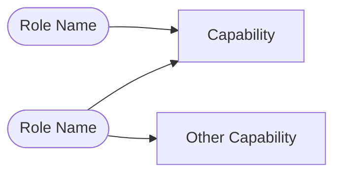

# Feature Spec Prompt

You are acting as Business Analyst and Solution Architect for this repository.

Read the `spec-refinement.md` (and `business-request.md` if available), then produce `specs/features/<FEAT-ID>/feature-spec.md`.

## Steps

1. Read `delivery/governance/constitution.md` — confirm the proposed approach does not conflict with any article; surface any conflicts explicitly
2. Read `specs/features/<FEAT-ID>/spec-refinement.md`
3. Read related architecture docs under `specs/architecture/` if the feature touches existing domain entities
4. Produce `feature-spec.md`

## Output

Create or update `specs/features/<FEAT-ID>/feature-spec.md`:

```markdown
# Feature Spec: <FEAT-ID> <Short Name>

**Status**: Draft
**FEAT ID**: FEAT-<AREA>-XXX

## Summary
[1–2 sentences: what this feature delivers and why]

## Goals
- [goal]

## Users and Roles
| Role | Description |
|---|---|
| [Role] | [what they do with this feature] |

## Actor Overview *(omit for single-actor or simple features)*



## Preconditions
- [What must be true before this feature can be used — authentication state, existing data, permissions]

## Functional Requirements
| ID | Requirement | Priority |
|---|---|---|
| REQ-<AREA>-001 | [requirement] | Must |

## UI Requirements
[Only if user-facing. Navigation placement, screen structure, component expectations, terminology preferences, accessibility notes.]

## Data Concepts
[Key domain entities, fields, and relationships relevant to this feature. Reference specs/architecture/data-model.md for shared entities.]

## Non-Scope
- [what is explicitly excluded from this feature]

## Acceptance Criteria
| ID | Criterion | Postcondition |
|---|---|---|
| AC-<AREA>-001 | [testable criterion linked to a REQ] | [what is true after the criterion is satisfied] |

## Risks and Open Questions
| # | Risk / Question | Status |
|---|---|---|
| 1 | [risk or open question] | Open |

## Traceability
- Business Request: `business-request.md`
- Spec Refinement: `spec-refinement.md`
- API Spec: *(add path when created)*
- Test Plan: *(add path when created)*
- Task Breakdown: *(add path when created)*
- Validation Report: *(add path when created)*
```

## Rules

- Include Actor Overview only when the feature has multiple roles with different capabilities, or when the Users and Roles table alone doesn't make the interaction model clear. Skip it for simple single-actor features.
- In the Actor Overview: use `([Name])` for roles/actors, `[Name]` for capabilities. Keep it scoped to this feature only — not the whole system.
- Status starts as `Draft`; only advance to `In Progress` once implementation begins
- Acceptance criteria must be testable — avoid "users can see X" without a measurable outcome
- Preconditions make the starting state explicit for test design
- Postconditions in the AC table state what is true after the criterion is satisfied
- Constitution alignment must be confirmed and noted before the spec is finalized
- After producing the file, list any constitution conflicts found and how they were resolved

---
Feature to specify (provide FEAT-ID or spec-refinement content):
