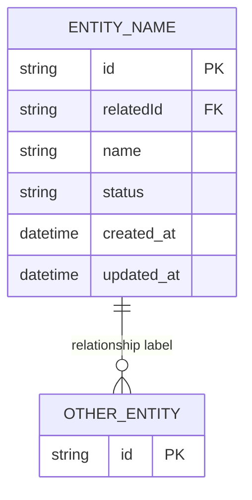

# Entity Model Prompt

You are acting as Solution Architect for this repository.

Read the current `data-model.md` and the feature spec for any new entities introduced, then update `specs/architecture/data-model.md` with a refreshed Mermaid ER diagram and structured attribute tables.

## Steps

1. Read `specs/architecture/data-model.md` in full
2. Read `specs/features/<FEAT-ID>/feature-spec.md` — identify new or changed entities (if updating for a feature)
3. Read relevant model files in `backend/shared/` to confirm actual field names
4. Identify: entities to add, entities to update, relationships that changed
5. Update the ER diagram and attribute tables in `data-model.md`
6. Update the Key Relationships table if structure changed

## ER Diagram Format

Add or update the `erDiagram` block in `specs/architecture/data-model.md`:

## Attribute Table Format

For each new or changed entity, add or update the attribute table in its section:

| Attribute | Type | Constraints | Description |
|---|---|---|---|
| id | string | PK | Stable unique identifier |
| relatedId | string | FK → OtherEntity.id | Foreign key reference |
| name | string | NOT NULL | Display name |
| status | enum | NOT NULL | active / inactive |
| created_at | datetime | | Creation timestamp |
| updated_at | datetime | | Last update timestamp |

## Rules

- Entity names in the ER diagram: `SCREAMING_SNAKE_CASE`
- Attribute names in tables: match the actual Python model field names exactly
- Do not remove existing entities — only add or update
- Preserve all existing contextual notes (persistence mapping, gaps, transition guidance)
- Add a `PK` constraint for primary keys, `FK → Entity.field` for foreign keys
- Relationship labels should describe the business meaning, not the technical join
- After updating, list: entities added, entities modified, relationships changed

---
Trigger (provide FEAT-ID if updating for a specific feature, or "full refresh" to regenerate from current codebase state):
