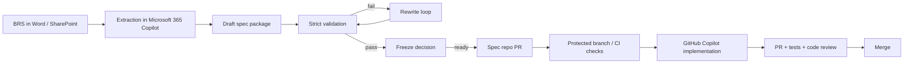
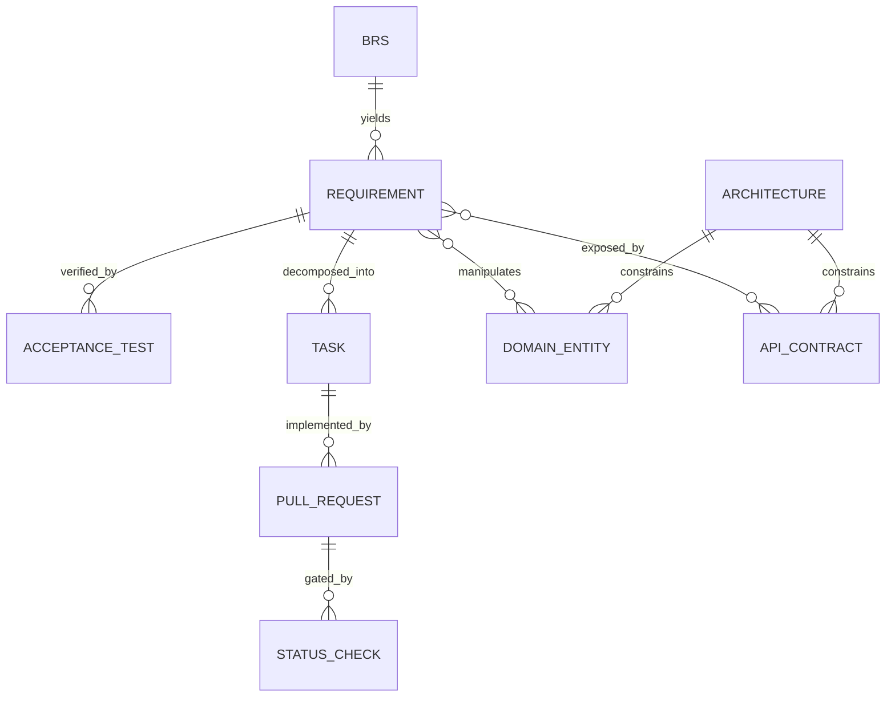
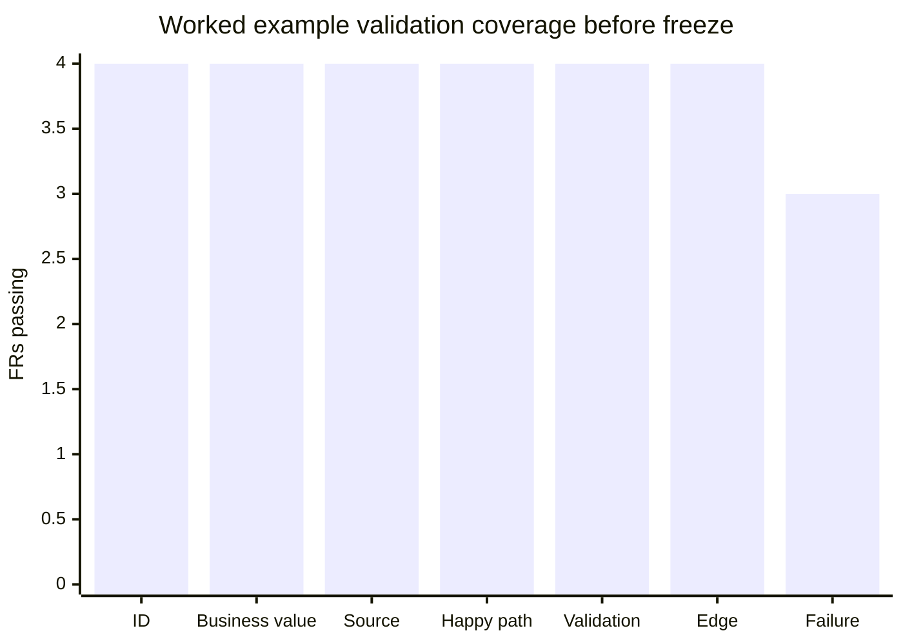

# Enterprise Prompt Pack and Workflow for Spec-Driven Development with Microsoft 365 Copilot and GitHub Copilot

## Executive summary

At enterprise scale, the cleanest operating split is to use Microsoft 365 Copilot for grounded BRS analysis and first-draft specification extraction, and to use GitHub Copilot only after the resulting spec package has been validated, rewritten where necessary, and formally frozen. That split matches the documented strengths of the two products. Microsoft 365 Copilot is designed to work across Microsoft 365 apps and Microsoft Graph, Word can draft from prompts and can use existing documents as sources, and Microsoft explicitly notes that Copilot in Word may be “usefully wrong”, which makes it valuable for extraction and drafting but unsuitable as an unreviewed source of implementation truth. citeturn6view5turn6view2turn6view4turn6view3

GitHub Copilot is the stronger implementation surface because GitHub supports repository-wide instructions, path-specific instructions, and `AGENTS.md`; it provides agent mode in IDEs for bounded autonomous edits; and it offers a cloud agent on GitHub that can research a repository, create a plan, modify a branch, and run tests in an Actions-powered ephemeral environment. GitHub also supports automatic Copilot code review, while documenting that Copilot review should supplement human review rather than replace it. citeturn6view7turn11view2turn7view0turn7view6turn6view11turn7view3

The practical recommendation in this report is therefore a five-step spec-driven control loop: **extraction → validation → rewrite → freeze → implementation**. The extraction step lives in Microsoft 365; the freeze and implementation controls live in version control and pull-request policy. In Azure and multi-team environments, the minimum governance baseline should be: work-grounded extraction only, explicit source traceability on every requirement, a strict validation pass, a no-guessing implementation guard, required status checks or build validation, and at least two human reviewers on the protected branch. Microsoft documents that Microsoft 365 Copilot respects existing permissions, sensitivity labels, and service-boundary protections; Microsoft and GitHub documentation also support pull-request gating through branch protection or branch policies. citeturn10view3turn10view4turn10view0turn6view13turn6view14turn12view0

| Decision area | Recommendation | Why it is the safer enterprise default |
|---|---|---|
| BRS understanding | Microsoft 365 Copilot in Word, Copilot Chat, Pages, or Notebooks | Best grounding on work files and collaboration artefacts |
| Source of truth | Markdown spec package in a repo | Versioned, reviewable, diffable, CI-checkable |
| Implementation trigger | Frozen `requirements.md` + `architecture.md` + `tasks.md` | Prevents scope drift and speculative coding |
| Copilot control plane | Repo instructions + path-specific instructions + `AGENTS.md` | Persistent constraints survive across users and sessions |
| Merge gate | PR with required checks and two human approvals | Makes AI output reviewable and auditable |

## Design basis and tool split

This report uses the current product name, Microsoft 365 Copilot, and deliberately follows guidance published by entity["company","Microsoft","software company"] and entity["company","GitHub","developer platform company"]. Microsoft’s own prompt guidance frames an effective prompt around **goal, context, expectations, and source**. Word can use existing files as sources via `/filename`, Prompt Gallery can save and share prompts across teams, Copilot Pages provides a persistent and shareable drafting canvas, and Copilot Notebooks can gather files, pages, meeting notes, links and other references into one working space. On the engineering side, GitHub documents repository-wide instructions in `.github/copilot-instructions.md`, path-specific instructions in `.github/instructions/**/*.instructions.md`, `AGENTS.md` support in key surfaces, IDE agent mode, and a GitHub-hosted cloud agent. citeturn6view3turn6view2turn8view0turn8view1turn8view2turn6view7turn11view2turn7view6

The comparison below is a synthesis of those documented capabilities, tuned for spec-driven delivery rather than casual prompting. Prompt files are useful, but GitHub documents them as **public preview** and limited to VS Code, Visual Studio, and JetBrains, so they should be treated as optional convenience layers rather than the primary enterprise control mechanism. citeturn6view9turn7view5

| Surface | Best use in this workflow | Strength | Limitation | Recommended control pattern |
|---|---|---|---|---|
| Microsoft 365 Copilot in Word | Single BRS extraction from a source document | Strong document grounding; easy `/filename` sourcing | Draft output can still be wrong or incomplete | Use the extraction prompt and force `BEGIN FILE / END FILE` blocks |
| Copilot Chat + Pages | Collaborative refinement of the extracted spec | Persistent, shareable, easy to iterate | Still needs repo transfer and review | Use for redrafting, not for freeze authority |
| Copilot Notebooks | Larger discovery packs with several sources | Best when a BRS depends on multiple files, notes and pages | More setup and governance overhead | Use when one BRS is not the whole story |
| Prompt Gallery | Cross-team prompt reuse | Standardises prompting across teams | Does not enforce repository-level controls | Publish approved extraction and validation prompts here |
| GitHub Copilot Chat | Scoped reasoning inside the repo | Reads repository context and instructions | Easy to drift if prompts are loose | Always anchor on frozen spec files |
| GitHub Copilot agent mode | Local implementation assistance | Good for bounded, multi-file edits | Still local to the developer environment | Use only for one FR or one task bundle |
| GitHub Copilot cloud agent | Repo research, plan, branch and PR creation | Transparent GitHub-native workflow with logs and automation | Needs strong repository controls and reviews | Use for routine, well-frozen work only |
| Prompt files | Repeatable IDE prompts | Convenient for developers | Preview, IDE-scoped, not universal | Optional; never the sole control layer |

The important architectural conclusion is simple: **Microsoft 365 Copilot should produce candidate specs, while GitHub Copilot should only consume frozen specs**. That separation reduces hallucinated requirements, preserves traceability back to the BRS, and gives the organisation a natural review checkpoint before code exists. Word’s “usefully wrong” warning and GitHub’s “supplement human review, don’t replace it” guidance both point to the same operating discipline. citeturn6view4turn7view3

## Spec-driven framework

The core framework is deliberately concise. Each step exists to remove a different class of failure.

| Step | Objective | Main output | Primary owner | Why this step exists |
|---|---|---|---|---|
| Extraction | Turn BRS prose into atomic, testable, traceable spec files | `vision.md`, `requirements.md`, `open-questions.md` | BA / architect | BRS prose is rarely implementation-ready |
| Validation | Detect ambiguity, overlap, vagueness and missing scenarios | Validation report | Architect / QA lead | Most AI-generated specs fail here, not at extraction |
| Rewrite | Repair only the invalid parts, without destabilising valid content | Rewrite patch | BA / architect | Prevents whole-document churn and ID drift |
| Freeze | Decide whether the package is implementation-ready | Freeze decision + manifest | Product owner + architect + engineering lead | Stops coding on unstable requirements |
| Implementation | Build one requirement or one task bundle at a time | PR + tests + traceability notes | Developer / GitHub Copilot | Converts frozen intent into reviewable increments |

The rationale is practical rather than theoretical. Extraction leverages Microsoft 365’s work-grounded context. Validation and rewrite are explicit because a single-pass prompt almost always leaves ambiguity or bundled requirements behind. Freeze exists because multi-team engineering needs a visible contract boundary. Implementation is separate because GitHub Copilot performs best when the task is sharply bounded and repository controls are persistent. citeturn6view2turn8view1turn6view7turn11view2turn7view0turn7view6



A useful enterprise refinement is to treat the validation and freeze artefacts as first-class repository outputs, not just chat transcripts. In other words: the commit history should show not only the spec itself, but the evidence that the spec passed review.

## Reusable prompt pack

The prompts below are written to be stable, reusable, and team-shareable. On the Microsoft 365 side they deliberately mirror Microsoft’s documented **goal / context / expectations / source** pattern. On the GitHub side they assume repository-resident controls such as `.github/copilot-instructions.md`, path-specific instruction files, and `AGENTS.md`, because GitHub documents those as the persistent customisation layers available across major Copilot surfaces. citeturn6view3turn6view7turn11view2

### Microsoft 365 Copilot extraction prompt

```text
You are a senior enterprise architect producing a SPECIFICATION CONTRACT from a Business Requirements Specification.

Context:
- This output will be used by AI agents and developers.
- Precision is more important than creativity.
- Use ONLY the BRS and explicitly referenced source files.
- If anything is unclear, move it to Open Questions or Assumptions.
- Do not invent requirements.

Goal:
Transform the BRS into a markdown spec package that can be copied into a repository.

Source:
- Primary source: the current BRS
- Additional sources, if supplied in the prompt: /[filename], /[filename]

Mandatory output format:
Output EXACTLY the following file blocks in this order.

BEGIN FILE: vision.md
# Vision
## Business goal
## Users
## Scope
## Out of scope
## Success criteria
END FILE

BEGIN FILE: requirements.md
# Requirements

For EACH requirement use this exact structure:

### FR-XXX — <short title>

Description:
<clear, atomic description>

Business value:
<why the requirement exists>

Acceptance Criteria:
- Given <context>
  When <action>
  Then <expected result>

- Include at least:
  - one happy-path scenario
  - one validation or input-error scenario
  - one edge case or exception scenario
  - one failure or dependency scenario if relevant

Priority:
Must | Should | Could

Source:
<exact BRS section / heading / page reference>

Notes:
<optional clarifications>

Then add:

## Non-Functional Requirements
Group only the NFRs that are explicitly present or strongly evidenced in the BRS under:
- Security
- Performance
- Availability
- Auditability
- Compliance
- Usability
- Maintainability

For each NFR include:
- ID: NFR-XXX
- Requirement
- Measurable criterion
- Source

END FILE

BEGIN FILE: open-questions.md
# Open Questions
For each question include:
- ID: Q-XXX
- Related requirement(s)
- Question
- Why it blocks or changes implementation
- Needed from
END FILE

BEGIN FILE: assumptions.md
# Assumptions
List only assumptions that are necessary to proceed.
Each assumption must include:
- ID: A-XXX
- Statement
- Why it is an assumption
- Related requirement(s)
END FILE

BEGIN FILE: risks.md
# Risks
Group into:
- Business risks
- Technical risks
- Integration risks
- Data risks
For each risk include:
- ID: R-XXX
- Description
- Impact
- Trigger
- Mitigation option
END FILE

Mandatory rules:
- Atomicity: split large statements into standalone FRs.
- Testability: every FR must be independently testable.
- Traceability: every FR and NFR must cite the exact source location.
- Language: use concise, implementation-neutral English.
- Forbidden words unless qualified with specifics: handle, manage, support, optimise, robust, user-friendly, seamless, appropriate, timely.
- Do not add architecture, API, database, or UX design details in this step unless the BRS explicitly states them.
- If the BRS conflicts with itself, preserve the conflict in Open Questions and cite both locations.

Quality bar:
If a requirement is not atomic, not testable, not unambiguous, or not traceable, it is invalid and must be rewritten before output.
```

### Strict validation prompt

```text
You are a strict QA validator reviewing a SPECIFICATION CONTRACT for implementation readiness.

Context:
- This spec will drive delivery and automated code generation.
- Be harsh.
- Prefer false negatives to false positives.
- Do not rewrite the whole spec. Diagnose it.

Input:
- vision.md
- requirements.md
- open-questions.md
- assumptions.md
- risks.md
- optional: architecture.md, domain-model.md, api-contracts.md

Validation rules:
1. Every FR must be atomic.
2. Every FR must be testable.
3. Every FR must have business value.
4. Every FR must have Given/When/Then acceptance criteria.
5. Acceptance criteria must cover:
   - happy path
   - validation / invalid input
   - edge or exception case
   - failure / dependency scenario where relevant
6. Every FR must have a priority.
7. Every FR must have a precise source reference.
8. No duplicates or major overlap between FRs.
9. No architecture leakage inside requirements unless explicitly sourced.
10. NFRs must be measurable.
11. Open questions must capture all blocking ambiguities.
12. Assumptions must be clearly separated from facts.

Mandatory output format:

# Validation Report

## Gate decision
PASS | FAIL

## Executive assessment
<2-5 sentences>

## Invalid requirements
| ID | Rule failed | Why invalid | Severity | Suggested action |
|---|---|---|---|---|

## Missing scenarios
| ID | Missing scenario type | Why it matters | Suggested addition |
|---|---|---|---|

## Duplicates or overlap
| IDs | Problem | Suggested resolution |
|---|---|---|

## Weak NFRs
| ID | Current wording | Why weak | Better measurable shape |
|---|---|---|---|

## Missing traceability
| ID | Missing or weak source | What is needed |
|---|---|---|

## Freeze blockers
List only blockers that must be resolved before implementation.

## Non-blocking improvements
List improvements that can wait until after freeze.

Strict rules:
- Do not silently fix problems.
- If a requirement contains vague verbs or undefined terms, fail it.
- If a requirement bundles multiple behaviours, fail it.
- If a source reference is broad like “BRS section 3” but not exact enough, mark it weak.
- If a requirement cannot be turned into a deterministic test, fail it.
```

### Rewrite loop prompt

```text
Rewrite ONLY the invalid or weak parts of the spec identified in the latest Validation Report.

Context:
- Keep valid content unchanged.
- Preserve existing IDs whenever possible.
- If one invalid FR must be split, keep the original ID retired and create child IDs such as FR-005a and FR-005b.
- Do not introduce new scope.

Mandatory output format:

# Rewrite Patch

## Rewritten requirements
For each changed FR output the FULL replacement block using the original requirements.md format.

## Rewritten NFRs
For each changed NFR output the FULL replacement block.

## Open questions to add or update
List any new or revised Open Questions in the open-questions.md format.

## Retired IDs
List any FR or NFR IDs that should be retired because they were split or removed, with reason.

Strict rules:
- Do not modify valid requirements.
- Do not invent answers to open questions.
- Do not add implementation details.
- Keep wording concise and testable.
```

### Freeze confirmation prompt

```text
You are the specification release gate.

Goal:
Decide whether this specification package is READY FOR IMPLEMENTATION.

Evidence to inspect:
- latest requirements.md
- open-questions.md
- architecture.md
- domain-model.md
- api-contracts.md
- tasks.md
- latest Validation Report

Mandatory freeze criteria:
- no critical validation failures remain
- each FR is uniquely identified, atomic, testable, and traceable
- acceptance criteria include happy path and non-happy-path coverage
- architecture exists for any non-trivial implementation
- domain model exists if entities or records are involved
- API contracts exist if the solution exposes or consumes APIs
- tasks map back to FR IDs
- remaining open questions are explicitly marked non-blocking

Mandatory output format:

# Freeze Decision

SPEC STATUS:
READY FOR IMPLEMENTATION
or
NOT READY FOR IMPLEMENTATION

## Decision rationale
<clear explanation>

## Blocking items
| Type | ID | Why blocking | Required action |
|---|---|---|---|

## Non-blocking carry-forwards
| Type | ID | Treatment after freeze |
|---|---|---|

## Freeze manifest
- initiative:
- spec version:
- approved date:
- approved by:
- notes:

Rule:
Only output READY FOR IMPLEMENTATION if the package satisfies every freeze criterion.
```

### GitHub Copilot implementation guard prompt

```text
You are a senior engineer working under a frozen specification contract.

Task:
Implement ONLY the specified requirement(s) or task(s).

Inputs you must use:
- /specs/<initiative-id>/requirements.md
- /specs/<initiative-id>/architecture.md
- /specs/<initiative-id>/domain-model.md
- /specs/<initiative-id>/api-contracts.md
- /specs/<initiative-id>/tasks.md
- repository instruction files, including:
  - .github/copilot-instructions.md
  - .github/instructions/**/*.instructions.md
  - AGENTS.md (if present)

Mandatory operating rules:
- Do not implement requirements that are not explicitly in scope.
- Do not guess missing behaviour.
- If the spec is unclear or incomplete, stop and raise a clarification instead of coding.
- Follow architecture constraints.
- Keep changes minimal and focused.
- Add or update tests that prove the acceptance criteria.
- Preserve traceability by referencing FR IDs in commit messages, PR descriptions, test names, and comments where appropriate.
- Never weaken security, validation, or audit requirements to make tests pass.

Mandatory output format before making changes:

# Implementation Plan
## In-scope requirement(s)
- FR-...

## Files to change
- path/to/file

## Approach
<short explanation>

## Tests to add or update
- unit
- integration
- contract
- end-to-end (if relevant)

## Out of scope confirmed
List nearby areas you will NOT change.

## Clarifications needed
If none, write "None".

After implementation, provide:

# Implementation Summary
## Completed
## Tests run
## Remaining risks
## Follow-up tasks
```

The downloadable pack also includes optional extension prompts for `architecture.md`, `domain-model.md` plus `api-contracts.md`, and `tasks.md`. Those are useful because most teams need them after extraction and before freeze, but they should run only against already-validated requirements.

## Templates and artefact model

The templates below are the minimum viable spec package for enterprise delivery. The principle is simple: each file should exist for a reason, and each file should be readable by both humans and AI agents without hidden context.



### `vision.md`

```md
# Vision

## Business goal
- Problem to solve:
- Desired business outcome:
- Success measure(s):
- Time horizon:

## Users
| User type | Goals | Pain points | Notes |
|---|---|---|---|

## Scope
- In scope:
- In scope:
- In scope:

## Out of scope
- Not in scope:
- Not in scope:

## Success criteria
| ID | Criterion | Measure | Source |
|---|---|---|---|
```

### `requirements.md`

```md
# Requirements

## Functional Requirements

### FR-001 — <short title>

Description:
<clear, atomic behaviour>

Business value:
<why it matters>

Acceptance Criteria:
- Given <context>
  When <action>
  Then <expected result>

- Given <validation context>
  When <invalid or missing input>
  Then <deterministic validation outcome>

- Given <edge or exception context>
  When <rare or boundary condition>
  Then <expected system behaviour>

- Given <dependency or failure context>
  When <downstream fault / timeout / concurrency issue>
  Then <expected safe outcome>

Priority:
Must | Should | Could

Source:
<BRS section / page / heading>

Notes:
<optional>

## Non-Functional Requirements

### NFR-001 — <short title>
Category:
Security | Performance | Availability | Auditability | Compliance | Usability | Maintainability

Requirement:
<what is required>

Measurable criterion:
<target or threshold>

Source:
<BRS section / page / heading>

Notes:
<optional>
```

### `open-questions.md`

```md
# Open Questions

### Q-001
Related requirement(s):
FR-...

Question:
<what is unclear>

Why it matters:
<delivery or design impact>

Needed from:
<business / legal / security / architecture / operations>

Decision due:
<date or milestone>

Status:
Open | Answered | Deferred
```

### `architecture.md`

```md
# Architecture

## Context
- Initiative:
- Business capability:
- Deployment boundary:
- Hosting target: Unspecified
- Identity boundary: Unspecified

## Actors and external systems
| Actor / system | Role | Trust boundary | Notes |
|---|---|---|---|

## Main components
| Component | Responsibility | Depends on | FR / NFR refs |
|---|---|---|---|

## Key flows
| Flow | Trigger | Outcome | FR refs |
|---|---|---|---|

## Data stores
| Store | Purpose | Data type | Retention / sensitivity | Notes |
|---|---|---|---|

## Security and compliance constraints
- Constraint:
- Constraint:

## Key design decisions
### ADR-001 — <decision title>
Context:
Decision:
Rationale:
Alternatives considered:
Trade-offs:
Triggered by:
FR / NFR refs:

## Unspecified decisions and options
| Decision area | Status | Viable options | Decision owner |
|---|---|---|---|
```

### `domain-model.md`

```md
# Domain Model

## Entities

### Entity: <name>
Purpose:
Identifiers:
Key attributes:
- <attribute> : <type> : <constraint>

Lifecycle states:
- <state>

Validation rules:
- <rule>

Source:
FR / NFR / BRS refs

## Relationships
| From | Relationship | To | Cardinality | Notes | Source |
|---|---|---|---|---|---|

## Events and invariants
| Type | Statement | Source |
|---|---|---|
```

### `api-contracts.md`

```md
# API Contracts

## API inventory

### API-001 — <purpose>
Related FRs:
Protocol:
REST | GraphQL | Event | Batch | Unspecified

Endpoint / topic:
<method and path OR message topic>

Authentication / authorisation:
<expectation or unspecified>

Request:
```json
{
  "example": "shape"
}
```

Validation rules:
- <rule>

Success response:
```json
{
  "example": "shape"
}
```

Error conditions:
| Code | Condition | Client expectation |
|---|---|---|

Idempotency / concurrency notes:
<notes>

Source:
FR / NFR / BRS refs
```

### `tasks.md`

```md
# Tasks

## FR-001 — <short title>

- [ ] T-001-01 — <task description>
  - Related FR: FR-001
  - Definition of done:
  - Dependencies:
  - Suggested owner role:

- [ ] T-001-02 — <task description>
  - Related FR: FR-001
  - Definition of done:
  - Dependencies:
  - Suggested owner role:

## Cross-cutting
- [ ] T-X-01 — Update documentation
- [ ] T-X-02 — Add or update monitoring / logging
- [ ] T-X-03 — Review security and privacy impacts
```

A practical rule for Azure and multi-team environments is to leave service choices explicitly **unspecified** until architecture review if the BRS does not mandate them. For example: “compute: unspecified”, “data store: unspecified”, “identity integration: unspecified”, with options recorded rather than prematurely fixed. That keeps the spec package neutral, reviewable, and portable across teams.

## Validation, CI, and automated checks

A spec-driven workflow only works if the spec itself is gated with the same seriousness as code. GitHub documents branch protection rules that can require approving reviews and passing status checks, and warns that required status-check job names must be unique across workflows. Azure Repos branch policies can require a minimum number of reviewers, linked work items, comment resolution, and build validation with automatic triggers and optional path filters. Microsoft Defender for Cloud separately recommends at least two reviewers and no self-approval for both GitHub and Azure DevOps repositories. citeturn6view13turn6view12turn6view14turn6view15turn12view0

### Validation checklist

Use this checklist before freeze and again in PR review:

- The FR ID is unique.
- The title is specific and short.
- The description expresses one behaviour only.
- Business value is explicit.
- Acceptance criteria are deterministic.
- Acceptance criteria include a happy path.
- Acceptance criteria include invalid input or validation behaviour.
- Acceptance criteria include an edge or exception scenario.
- Acceptance criteria include a failure or dependency scenario where relevant.
- Priority is present and realistic.
- Source cites an exact BRS location.
- No implementation details leak into the requirement.
- NFRs are measurable.
- Open questions capture all blocking ambiguities.
- Tasks trace back to FR IDs.

### Automated checks and merge gates

For GitHub, centralise spec validation as a reusable workflow using `workflow_call`. For Azure Pipelines, centralise the same logic as a YAML template or `extends`-based standard. GitHub documents reusable workflows in `.github/workflows` with `on: workflow_call`, while Azure documents YAML templates and `extends` templates specifically as a way to enforce security, compliance, and organisational standards. citeturn6view16turn13view0

| Check | What it validates | GitHub implementation | Azure implementation | Block merge |
|---|---|---|---|---|
| Spec lint | IDs, required fields, Given/When/Then, source presence | Required status check from `checks/validate_specs.py` | Build validation policy running the same script | Yes |
| Traceability | Each FR linked to source and tasks | Script + PR template requiring FR IDs | Script + linked work item policy | Yes |
| Freeze integrity | `READY FOR IMPLEMENTATION` only when blockers are cleared | PR checklist + protected branch | Branch policy + manual approval gate | Yes |
| Human review | AI output has human sign-off | Require at least two approvals; disallow self-approval by policy | Minimum reviewers; required reviewers | Yes |
| Comment resolution | Review comments closed before merge | Branch protection plus review discipline | Comment resolution policy | Yes |
| Regressions | Tests for changed FRs pass | Required test workflow | Required build pipeline | Yes |

### Heuristics for invalid and valid requirements

| Pattern | Invalid example | Valid shape |
|---|---|---|
| Vague verb | “The system shall manage users efficiently.” | “The system shall allow an authorised administrator to create a user account with first name, surname, work email, and role.” |
| Non-measurable NFR | “Reports shall be quick.” | “The summary report endpoint shall return within p95 ≤ 2 seconds under normal business load.” |
| Bundled behaviour | “Import CSV and correct errors.” | Split into “Import valid CSV” and “Reject malformed CSV with row-level errors.” |
| Undefined trigger | “Notify users when appropriate.” | “Send an approval email to the request submitter when the assigned manager approves the request.” |
| Missing failure path | “Print a badge when the visitor arrives.” | “Record arrival first; if badge printing fails, preserve the arrival and return a print-failure message.” |

The downloadable prompt pack includes a ready-to-run `validate_specs.py` script that implements the basic lint rules and two CI stubs: one for GitHub Actions and one for Azure Pipelines. The included checks intentionally stay dependency-light so that teams can adopt them quickly, then harden them later.

## Integration workflow and governance

A robust enterprise flow begins with work-grounded drafting in Microsoft 365, not free-form web prompting. Microsoft documents that Microsoft 365 Copilot only surfaces organisational data the current user can access, that prompts and generated responses remain within the Microsoft 365 service boundary, and that prompts, responses, and Microsoft Graph data are not used to train the foundation LLMs used by Microsoft 365 Copilot. Microsoft also documents that sensitivity labels, encryption, SharePoint access controls, and audit capabilities continue to apply. One important guardrail is that when Microsoft 365 Copilot uses web search, it derives a search query from the prompt and sends it to Bing Search, so sensitive BRS extraction should be explicitly source-bound to work files rather than left open-ended. citeturn10view3turn10view4turn10view0

image_group{"layout":"carousel","aspect_ratio":"16:9","query":["Microsoft 365 Copilot in Word screenshot", "Microsoft 365 Copilot Prompt Gallery screenshot", "GitHub Copilot agent mode VS Code screenshot", "GitHub pull request code review screenshot"], "num_per_query": 1}

Microsoft’s collaboration surfaces make the drafting side of the workflow easier to standardise. Prompt Gallery can save and share approved prompts with teams, Copilot Pages gives a persistent and shareable artefact for the first draft, and Copilot Notebooks are useful when the BRS depends on several files, pages, meetings or links. GitHub’s repository instructions, path-specific instructions, and cloud-agent support form the matching control layer on the engineering side. citeturn8view0turn8view3turn8view1turn8view2turn11view2

The recommended end-to-end flow is:

1. Store the BRS and supporting artefacts in Word / SharePoint / OneDrive with correct permissions.
2. Run the **extraction prompt** in Word or Copilot Chat/Pages, explicitly grounding on the BRS and any named source files.
3. Copy the resulting file blocks into a spec repository under `/specs/<initiative-id>/`.
4. Run the **validation prompt** and commit the Validation Report.
5. Run the **rewrite prompt** until the validation gate passes.
6. Generate `architecture.md`, `domain-model.md`, `api-contracts.md`, and `tasks.md`.
7. Run the **freeze prompt** and record the Freeze Decision.
8. Open a spec PR and require CI checks plus human approvals.
9. Only after the spec merges, run the **implementation guard prompt** in GitHub Copilot for one FR or one task bundle at a time.
10. Use Copilot code review as a supplement and keep human review mandatory. citeturn6view11turn7view2turn7view3

### Governance model

| Role | Primary responsibility | Must approve | Typical artefacts owned |
|---|---|---|---|
| Business owner / product owner | Intent, scope, priority, decisions on open questions | Freeze | Vision, source clarifications |
| BA / product analyst | BRS decomposition and traceability | Validation | Initial extraction, requirements, questions |
| Solution architect | Structural coherence and non-functional fit | Freeze | Architecture, domain model, API contracts |
| Security / compliance reviewer | Data handling, RBAC, audit, retention controls | Freeze where relevant | NFRs, risk notes, retention and access decisions |
| Engineering lead | Implementability, task decomposition, merge standards | Freeze and PR policy | Tasks, repo controls, CI checks |
| Developer | Delivery of one frozen slice at a time | PR | Code, tests, traceability notes |
| GitHub Copilot | Assisted implementation within repository controls | Never alone | Plans, code proposals, test suggestions |
| QA / reviewer | Verification against acceptance criteria | PR | Test evidence, defect findings |

### Freeze criteria

Mark a spec package **READY FOR IMPLEMENTATION** only if all of the following are true:

- No critical validator failures remain.
- Every FR is atomic, testable, traceable, and prioritised.
- Every FR covers at least one non-happy-path scenario.
- NFRs are measurable or explicitly blocked.
- Architecture exists for any non-trivial solution.
- Domain and API artefacts exist where the solution manipulates records or exposes interfaces.
- Tasks map back to FR IDs.
- Remaining open questions are explicitly tagged non-blocking.

### Anti-hallucination guardrails

The most effective guardrails are procedural, not magical.

| Risk | Guardrail |
|---|---|
| Copilot invents requirements | Separate extraction from validation; force explicit sources and open questions |
| Ambiguous BRS becomes “helpful” implementation detail | Ban guessing in the implementation prompt and in `AGENTS.md` |
| Repo-specific rules disappear between sessions | Store controls in `.github/copilot-instructions.md`, path-specific instruction files, and `AGENTS.md` |
| AI-generated code sails through with no scrutiny | Require protected branches, passing checks, and human approval |
| Teams drift into different prompting styles | Publish approved prompts in Prompt Gallery and keep the canonical copies in version control |
| Sensitive content leaks into web search | Keep BRS extraction source-bound to internal files and avoid open-ended web-grounded prompts for confidential material |

## Worked example and downloadable deliverables

The example below is intentionally compact, but it shows the whole control loop.

### Hypothetical BRS

```text
A company wants a lightweight visitor registration service for reception staff in two offices.

Visitors must be pre-registered by employees before arrival. Reception staff must be able to search for a visitor by surname or booking reference, mark the visitor as arrived, and print a badge. The system must record arrival time and the employee host. If a visitor is not found, reception staff must be able to create a manual entry.

The service must support English and French. Personal data must be retained for 30 days and then deleted. The service should be available during office hours. Failed badge printing should not lose the arrival record.
```

### Extraction result

The extraction prompt produces a first draft roughly like this:

```md
# vision.md
## Business goal
Provide reception staff with a lightweight visitor registration service that reduces manual sign-in effort and improves arrival traceability.

## Users
- Employee host
- Reception staff

## Scope
- Visitor pre-registration
- Reception search
- Arrival recording
- Badge printing
- Manual visitor entry
- English and French support
```

```md
# requirements.md

### FR-001 — Pre-register visitor
Description:
The system shall allow an employee host to create a visitor booking before the visitor arrives.

Business value:
Enables reception to process arrivals quickly and identify the correct host.

Acceptance Criteria:
- Given an employee host with access to the service
  When valid visitor details are submitted
  Then a visitor booking is created with a unique booking reference
- Given an employee host
  When mandatory visitor details are missing
  Then the system rejects the submission and identifies the missing fields
- Given an employee host
  When a booking is created for a date in the past
  Then the system rejects the booking

Priority:
Must

Source:
BRS 3.1 "Visitor pre-registration"

### FR-003 — Record arrival and print badge
Description:
The system shall allow reception staff to mark a visitor as arrived and request badge printing.

Business value:
Creates an auditable arrival record while supporting physical badge issuance.

Acceptance Criteria:
- Given a valid visitor booking
  When reception marks the visitor as arrived
  Then the system records the arrival time and linked employee host
- Given a valid visitor booking
  When badge printing fails
  Then the arrival record remains stored and the user is informed that badge printing failed
- Given a visitor is already marked as arrived
  When reception repeats the arrival action
  Then the system prevents a duplicate arrival record

Priority:
Must

Source:
BRS 3.2 "Reception process"
```

```md
# open-questions.md
### Q-001
Related requirement(s):
FR-001, FR-004

Question:
Which visitor fields are mandatory for booking and for manual entry?

Why it matters:
Affects validation rules, UI design, and test coverage.

Needed from:
Business owner
```

### Validation and rewrite outcome

The validator would accept most of this draft, but it should still flag at least three issues:

- `FR-001` lacks fully specified mandatory data fields.
- The NFR “available during office hours” is not yet measurable.
- Badge-print content is unspecified, which blocks completion of the print contract.

That is precisely the kind of defect the rewrite-plus-freeze loop is designed to surface before code exists. After the business owner answers those open questions, the package can be rewritten, revalidated, and frozen.



The chart shows the practical point: a spec can look “mostly fine” while still failing one coverage dimension that matters. In this example, only three of four FRs are good enough on failure-path coverage before the rewrite patch fully stabilises the package.

### Example architecture, domain, API and tasks

A concise architecture response for the same BRS would probably contain a Web UI, API service, data store, badge-print adapter, and retention job, with a key decision that **arrival must be persisted before any badge-print attempt**. The domain model would include `VisitorBooking` and `ArrivalRecord`. The API contract would expose at least `POST /visitor-bookings` and `POST /visitor-bookings/{bookingReference}/arrival`. Tasks would then decompose each FR into API, UI, validation, integration and test tasks. The downloadable prompt pack includes the full generated example files for this scenario.

### Downloadable prompt pack

[Download the prompt pack](sandbox:/mnt/data/spec-driven-copilot-prompt-pack.zip)

The pack contains a ready-to-use structure:

```text
spec-driven-copilot-prompt-pack/
  README.md
  prompts/
    01-m365-extraction.md
    02-strict-validation.md
    03-rewrite-loop.md
    04-freeze-confirmation.md
    05-github-implementation-guard.md
    06-optional-architecture-expansion.md
    07-optional-domain-and-api.md
    08-optional-task-decomposition.md
  templates/
    vision.md
    requirements.md
    open-questions.md
    architecture.md
    domain-model.md
    api-contracts.md
    tasks.md
  checks/
    validation-checklist.md
    invalid-vs-valid.md
    spec-lint-rules.md
    validate_specs.py
  ci/
    github-spec-guard.yml
    azure-pipelines-spec-guard.yml
  repo/
    .github/copilot-instructions.md
    .github/instructions/specs.instructions.md
    AGENTS.md
  examples/
    hypothetical-brs.md
    generated/
      vision.md
      requirements.md
      open-questions.md
      architecture.md
      domain-model.md
      api-contracts.md
      tasks.md
```

### Usage guidelines

Start with one initiative, not the whole portfolio. Put the BRS in Word or SharePoint, run the extraction prompt, and copy the output into a fresh `/specs/<initiative-id>/` folder. Run the validation and rewrite loop until the validator stops finding blockers. Generate architecture, domain, API and tasks. Open a PR for the spec package and protect the branch. Only then allow GitHub Copilot to implement one FR or one task bundle at a time.

If your environment is split across several Azure teams, standardise three things first and everything else later: the extraction prompt, the `requirements.md` template, and the CI spec guard. That gives you a repeatable operating core without forcing every team onto the same application stack before you are ready.
