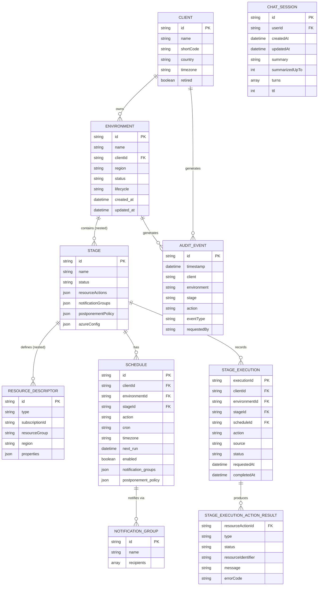

# Data Model

## Purpose

Describe the main persistent and semi-persistent data structures in the current repository.

This is a lightweight shared data model reference. It is not intended to replace API contracts or full ER diagrams.

## Scope

Current domain focus:

- clients
- environments
- stages
- Azure service/resource action descriptors
- schedules
- notification groups
- postponement policy
- audit/activity events

## Core Relationship Model

The current intended business hierarchy is:

1. Client
2. Environment
3. Stage
4. Schedule

Interpretation:

- a client owns one or more environments
- an environment contains one or more stages
- a stage contains Azure service configuration
- a schedule belongs to a stage
- schedules own notifications and postponement behavior in the intended user-facing model

## Main Entities

### Client

Current status:

- implemented as a first-class shared business entity under the delivered `Client Management` capability
- related domains such as environments and schedules still contain legacy string-based client references in parts of the implementation
- expected to become a reusable reference domain for:
  - environments
  - schedules
  - future cloud-cost attribution
  - future incident and problem linkage

Used by:

- environments
- schedules
- storage partitioning in Cosmos-backed environment and schedule stores

Current model sources:

- `backend/shared/client_model.py`
- `backend/shared/client_store.py`

Attribute table:

| Attribute | Type | Constraints | Description |
| --- | --- | --- | --- |
| id | string | PK | Stable unique identifier |
| name | string | NOT NULL | Display name |
| shortCode | string | NOT NULL | Short reference code |
| country | string | | Country or region |
| timezone | string | | IANA timezone for schedule interpretation |
| clientAdmins | array | | List of admin user identifiers |
| retired | boolean | | Soft-delete flag |
| retiredAt | datetime | nullable | Timestamp of retirement |
| retiredBy | string | nullable | User who retired the record |

Current key fields:

- `id`
- `name`
- `shortCode`
- `country`
- `timezone`
- `clientAdmins`
- `retired`
- `retiredAt`
- `retiredBy`

Current direction:

- use the stable client `id` as the canonical identity for the client entity
- keep human-readable client name/code as display and lookup fields, not the only linkage mechanism
- define a minimum maintainable client record with core metadata rather than relying on free-form strings everywhere

Implemented first-release attributes:

- `id`
- display name
- short code
- country
- timezone
- client-admin ownership

Transition guidance:

- legacy records may still carry a free-form `client` label in early delivery or seed data
- canonical linkage should move to client `id`
- the preferred initial rollout path is to reset and recreate early-stage records in canonical form
- any temporary label-based compatibility should remain lightweight and resolve only exact unique matches on approved lookup fields
- ambiguous legacy labels should remain unresolved until corrected rather than being guessed

### Environment

Primary purpose:

- represent a client-owned managed environment and its stage composition

Current model source:

- `backend/shared/environment_model.py`

Attribute table:

| Attribute | Type | Constraints | Description |
| --- | --- | --- | --- |
| id | string | PK | Stable unique identifier |
| name | string | NOT NULL | Display name |
| clientId | string | FK → Client.id | Canonical client linkage |
| client | string | legacy | Legacy label-based client reference |
| region | string | | Azure region |
| status | string | | Current lifecycle status |
| lifecycle | string | | Lifecycle state descriptor |
| tags | object | | Arbitrary metadata tags |
| owners | array | | Owning user identifiers |
| created_at | datetime | | Record creation timestamp |
| updated_at | datetime | | Last update timestamp |
| stages | array | nested | Stage records (currently nested) |
| metadata | object | | Free-form metadata |

Important fields:

- `id`
- `name`
- `client`
- `clientId` (planned canonical linkage in dependent domains)
- `region`
- `status`
- `lifecycle`
- `tags`
- `owner`
- `owners`
- `created_at`
- `updated_at`
- `metadata`
- `stages`

Notes:

- `id` is the stable environment identifier
- uniqueness is currently enforced on the combination of `client` and `name`
- stages are stored as nested data inside the environment record

### Stage

Primary purpose:

- represent an operational step or level within an environment, such as `DEV`, `UAT`, or `PROD`

Current model source:

- `backend/shared/environment_model.py`

Attribute table:

| Attribute | Type | Constraints | Description |
| --- | --- | --- | --- |
| id | string | PK | Stable unique identifier |
| name | string | NOT NULL | Display name (e.g. DEV, UAT, PROD) |
| status | string | | Current status |
| resourceActions | array | nested | Azure service/action descriptors |
| notificationGroups | array | nested | Stage-level notification groups (transitioning to schedule ownership) |
| postponementPolicy | object | nested | Stage-level postponement policy (transitioning to schedule ownership) |
| azureConfig | object | | Azure configuration metadata |

Important fields:

- `id`
- `name`
- `status`
- `resourceActions`
- `notificationGroups`
- `postponementPolicy`
- `azureConfig`

Notes:

- the current backend model still contains stage-level notification and postponement fields
- the current user-facing direction is to keep Azure service setup at stage level and make schedules own notifications and postponement behavior
- this is a useful place to watch for future model cleanup or explicit inheritance rules
- the stage is also the canonical source of the Azure service/action definitions executed by start/stop orchestration

### Resource Descriptor

Primary purpose:

- describe an Azure service or action target associated with a stage

Current model source:

- `backend/shared/environment_model.py`

Important fields:

- `id`
- `type`
- `subscriptionId`
- `resourceGroup`
- `region`
- `properties`

Examples of service-specific values currently represented across the codebase:

- SQL VM
- SQL Managed Instance
- Synapse SQL pool
- Service Bus message

Expected first-release required `properties` by type:

- `sql-vm`
  - `vmName`
- `sql-managed-instance`
  - `managedInstanceName`
- `synapse-sql-pool`
  - `workspaceName`
  - `sqlPoolName`
- `service-bus-message`
  - `namespace`
  - `entityType`
  - `entityName`
  - `messageTemplate`

Notes:

- service-specific metadata may live partly in top-level fields in sample records and partly in `properties`
- this is a logical domain entity even when the precise field shape varies by resource type
- these descriptors are authored in Environment Management and later consumed by the orchestration runtime
- schedules do not define a second independent resource list; they point to the stage that already owns these descriptors

### Notification Group

Primary purpose:

- identify a named recipient grouping for notifications

Current model sources:

- `backend/shared/environment_model.py`
- `backend/shared/schedule_model.py`

Important fields:

- `id`
- `name`
- `recipients`

Notes:

- recipients are currently modeled as strings
- authorized postponement checks compare user identifiers against recipient values

### Postponement Policy

Primary purpose:

- define whether and how scheduled actions may be postponed

Current model sources:

- `backend/shared/environment_model.py`
- `backend/shared/schedule_model.py`

Important fields:

- `enabled`
- `maxPostponeMinutes`
- `maxPostponements`

Notes:

- schedule-level policy is the intended primary ownership model for the user-facing flow
- stage-level policy still exists in the current backend model

### Chat Session

Primary purpose:

- persist the multi-turn conversation history between an authenticated user and the AI assistant, with a rolling LLM-generated summary of older turns, so the assistant can maintain context across requests and page refreshes

Introduced by:

- FEAT-ASSISTANT-003

Current model source:

- `backend/shared/chat_session_store.py` (in-memory fallback + Cosmos adapter)

Important fields:

- `id` — UUID, document identifier
- `userId` — partition key; the authenticated user's identity
- `createdAt` — ISO UTC timestamp
- `updatedAt` — ISO UTC timestamp
- `summary` — optional rolling LLM summary of turns older than the token-budget window
- `summarizedUpTo` — index of the last turn included in the summary
- `turns` — ordered list of `{ role, content, token_count, timestamp }` entries (redacted before storage)
- `ttl` — Cosmos TTL in seconds (configurable via `CHAT_SESSION_TTL_DAYS`, default 7 days)

Notes:

- sessions are scoped to a single user; cross-user access is not permitted
- content is redacted by the same pipeline used for the live prompt before being persisted
- when the `summary` field is present it is injected as the first history entry in the prompt; raw turns older than `summarizedUpTo` are not re-injected
- the in-memory fallback (`CHAT_SESSIONS` module-level dict) is used when `COSMOS_CONNECTION_STRING` is absent, consistent with `STAGE_EXECUTIONS` and `CLIENTS` patterns
- Cosmos container: `chatsessions`, partition key `/userId`, TTL enabled

### Schedule

Primary purpose:

- define a recurring action for a stage

Current model source:

- `backend/shared/schedule_model.py`

Attribute table:

| Attribute | Type | Constraints | Description |
| --- | --- | --- | --- |
| id | string | PK | Stable unique identifier |
| clientId | string | FK → Client.id | Canonical client linkage (target) |
| environmentId | string | FK → Environment.id | Canonical environment linkage (target) |
| stageId | string | FK → Stage.id | Canonical stage linkage (target) |
| client | string | legacy | Legacy label reference |
| environment | string | legacy | Legacy label reference |
| stage | string | legacy | Legacy label reference |
| action | string | NOT NULL | start / stop |
| cron | string | NOT NULL | Cron expression |
| timezone | string | NOT NULL | IANA timezone |
| next_run | datetime | | Next scheduled execution time |
| enabled | boolean | | Whether the schedule is active |
| notify_before_minutes | integer | | Minutes before execution to notify |
| notification_groups | array | nested | Notification group definitions |
| postponement_policy | object | nested | Postponement rules |
| postponement_count | integer | | Number of times postponed |
| postponed_until | datetime | nullable | Postponed execution time |
| postponed_by | string | nullable | User who postponed |
| postpone_reason | string | nullable | Reason for postponement |
| last_notified_at | datetime | nullable | Timestamp of last notification |

Important fields:

- `id`
- `environment`
- `client`
- `stage`
- `action`
- `cron`
- `timezone`
- `next_run`
- `enabled`
- `owner`
- `notify_before_minutes`
- `notification_groups`
- `postponement_policy`
- `postponement_count`
- `postponed_until`
- `postponed_by`
- `postpone_reason`
- `last_notified_at`

Notes:

- schedule identity is stable through `id`
- the schedule links to the client, environment, and stage context
- the current implementation still stores `environment` and `stage` as label-like values in some paths
- the intended direction is to standardize schedule linkage on the existing stable `Environment.id` and `Stage.id` values
- historical archived specs already pointed toward explicit `environment_id` plus `stage_id` references
- environment and stage labels should remain display-oriented values or legacy fallback rather than the canonical linkage fields
- the schedule defines when a `start` or `stop` action is due for the stage
- the schedule is not the source of the Azure service/action definitions to execute

### Stage Execution

Primary purpose:

- record one immediate or scheduled start/stop execution against a stage

Current status:

- architecturally defined for `FEAT-EXECUTION-001 Start/Stop Services`
- first-release recommended durable persistence is Azure Cosmos DB
- persistence and runtime implementation are still evolving

Attribute table:

| Attribute | Type | Constraints | Description |
| --- | --- | --- | --- |
| executionId | string | PK | Unique execution identifier |
| clientId | string | FK → Client.id | Client context |
| environmentId | string | FK → Environment.id | Environment context |
| stageId | string | FK → Stage.id | Stage that was executed |
| scheduleId | string | FK → Schedule.id, nullable | Source schedule (null for immediate) |
| action | string | NOT NULL | start / stop |
| source | string | | scheduled / manual |
| status | string | NOT NULL | pending / running / succeeded / failed |
| requestedAt | datetime | NOT NULL | When execution was requested |
| startedAt | datetime | nullable | When execution began |
| completedAt | datetime | nullable | When execution completed |
| resourceActionResults | array | nested | Per-resource outcomes |

Expected key fields:

- `executionId`
- `clientId`
- `environmentId`
- `stageId`
- `scheduleId` when applicable
- `action`
- `source`
- `requestedAt`
- `startedAt`
- `completedAt`
- `status`
- `resourceActionResults`

Notes:

- this is the durable execution/result entity that bridges scheduler evaluation and portal readback
- it should represent last known orchestration result rather than guaranteed live Azure truth in first release

### Stage Execution Action Result

Primary purpose:

- record the outcome of one executed stage `resourceAction`

Expected key fields:

- `resourceActionId`
- `type`
- `status`
- `subscriptionId`
- `region`
- `resourceIdentifier`
- `message`
- `errorCode`
- timestamps where relevant

### Audit Event

Primary purpose:

- record user-driven and automated activity for environments and schedules

Current storage source:

- `backend/shared/audit_store.py`

Common fields:

- `timestamp`
- `environment`
- `client`
- `stage`
- `action`
- event-specific metadata such as:
  - `eventType`
  - `requestedBy`
  - `postponedUntil`
  - execution or notification details

Notes:

- audit data is currently append-oriented
- it supports UI activity history and operational traceability

## Persistence Mapping

### Environment Persistence

Current options:

- Azure Table Storage
- Azure Cosmos DB
- in-memory store for local development and tests

Table-backed environment store:

- table name default: `Environments`
- partition key: `"environments"`
- row key: environment `id`
- environment payload stored as JSON in `data`

Cosmos-backed environment store:

- database default: `adminportal`
- container default: `environments`
- partition key path: `/client`

### Schedule Persistence

Current options:

- Azure Cosmos DB
- in-memory store for local development and tests

Cosmos-backed schedule store:

- database default: `adminportal`
- container default: `schedules`
- partition key path: `/client`

### Stage Execution Persistence

Current intended options:

- Azure Cosmos DB as the recommended first-release durable store
- in-memory store for local development and tests

Recommended Cosmos-backed execution store:

- database default: `adminportal`
- container default: `stageexecutions`
- partition key path: `/clientId`
- document id: `executionId`

### Audit Persistence

Current options:

- Azure Table Storage
- JSON file fallback at `backend/shared/audit_log.json`

Table-backed audit store:

- table name default: `EnvironmentAudit`
- partition key: environment or client, with fallback to `global`
- row key: timestamp plus UUID

## ER Diagram

## Key Relationships

| Parent | Child | Relationship |
| --- | --- | --- |
| Client | Environment | one-to-many |
| Environment | Stage | one-to-many, currently nested |
| Stage | Resource Descriptor | one-to-many, currently nested |
| Stage | Schedule | intended one-to-many, schedule references stage context |
| Stage | Stage Execution | one-to-many over time |
| Stage Execution | Stage Execution Action Result | one-to-many |
| Schedule | Notification Group | one-to-many |
| Schedule | Postponement Policy | one-to-one or optional |
| Environment or Schedule activity | Audit Event | one-to-many over time |

## Current Modeling Gaps Worth Watching

- `Client` is a business parent but not yet a dedicated first-class persisted entity in this domain.
- `Schedule.environment` currently uses an environment name-like value rather than a durable environment identifier in part of the implementation.
- `Schedule.stage` currently uses a mutable stage label rather than a canonical `stage_id` in part of the implementation.
- Stage-level notification and postponement fields still exist in the environment model even though the intended user-facing ownership has moved toward schedules.
- Resource descriptors may mix normalized shared fields and service-specific free-form properties.
- Environment, schedule, and audit persistence are not yet unified behind one shared physical storage strategy.
- The durable `Stage Execution` persistence model is defined conceptually and now has a recommended first-release Cosmos-backed storage path, but runtime implementation details are still pending.

## Useful Next Steps

- add a durable `system-context.md` and `deployment-view.md` so the data model can be read together with hosting and integration boundaries
- complete the transition so schedule references use `environment_id` and `stage_id` canonically
- keep environment and stage labels as derived display values or legacy fallback only
- clarify whether stage-level notification and postponement are defaults, deprecated fields, or future inheritance inputs
- add a database-oriented relationship sketch if persistence becomes more relational or more normalized over time
